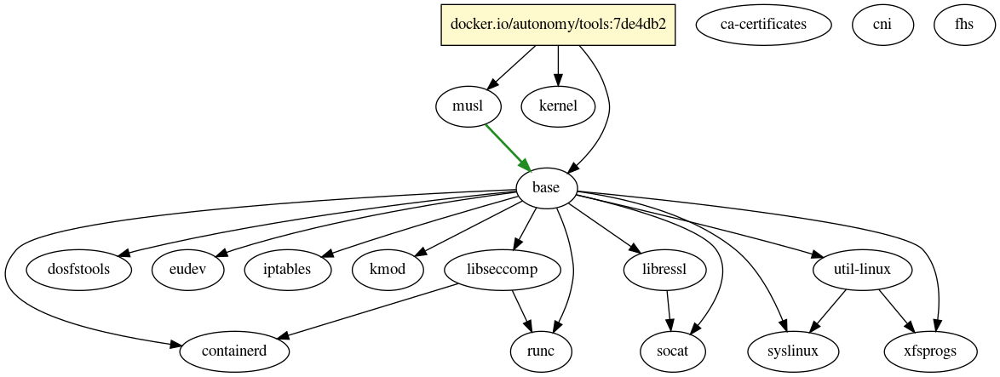

# Packer 👋

[](https://github.com/sentinelos/packer/releases)

`packer` is a tool to build and package software distributions.
Build process runs in [buildkit](https://github.com/moby/buildkit) (
or [nerdctl](https://github.com/containerd/nerdctl)), build result
can be exported as container image.

## Roadmap

- Tests
- Dependency resolution
- Leverage labels for things like:
    - Switching the base dir install command (we default to alpine apk install for now).
      We could add a label on the packer container `packer.io.base.distro=[alpine,ubuntu,centos,etc.]`

## Usage

Given directory structure with `Pkgfile` and `pkg.yaml`
(see [tools repository](https://github.com/sentinelos/pkgs) as an example),build can be triggered using following
commands:

- via `nerdctl`:

  ```sh
  nerdctl build -f ./Pkgfile --target tools .
  ```

- via `buildkit`:

  ```sh
  buildctl --frontend=dockerfile.v0 --local context=. --local dockerfile=. --opt filename=Pkgfile --opt target=tools
  ```

### Target

Each `packer` invocation specifies a target package to build, it is set as `--target` flag for `nerdctl`
and `--opt target=` option for `buildctl`. `packer` frontend is launched, it loads `Pkgfile` and scans subdirectories
for `pkg.yaml` files, resolves dependencies and produces [LLB](https://github.com/moby/buildkit#exploring-llb) input
which is executed in `buildkit` backend.
Result of execution is the target argument of the invocation.

### Saving output

Build output can be exported from buildkit using any of the methods supported
by [buildkit](https://github.com/moby/buildkit#output)
or [nerdctl](https://github.com/containerd/nerdctl#whale-nerdctl-build).
By default, if output is not specified output is saved in buildkit cache only.
This is still useful to test the build before pushing.

Most common output type is pushing to the registry:

- via `nerdctl`:

  ```sh
  nerdctl build -f ./Pkgfile --target tools --tag ghcr.io/vendor/repo:version --output type=image,name=ghcr.io/vendor/repo:version,push=true .
  ```

- via `buildctl`:

  ```sh
  buildctl --frontend=dockerfile.v0 --local context=. --local dockerfile=. --opt filename=Pkgfile --opt target=tools --output type=image,name=ghcr.io/vendor/repo:version,push=true
  ```

### Graphing packages

Graph of dependencies could be generated via `packer` CLI:

```shell
packer graph
```

This command also accepts `--target` flag to graph only part of the tree
leading to the target:

packer graph --target tools

`packer` outputs graph in [graphviz](http://www.graphviz.org/) format which can be rendered to any image format
via `dot`:

packer graph | dot -Tpng > graph.png

This renders graph like:



Boxes with yellow background are external images as dependencies, white
nodes are internal stages.
Arrows present dependencies: regular arrows for build dependencies and green bold arrows for runtime dependencies.

### Validating pkg.yaml files

`packer` always validates `pkg.yaml` files while loading them and fails the build on errors.
Validation step could also be executed separately as the first step before running actual build:

```shell
packer validate
```

## Format

`packer` expect following directory structure:

```text
├── Pkgfile
├── vars.yaml
├── protobuf
│   ├── patches
│   │   └── musl-fix.patch
│   └── pkg.yaml
├── protoc-gen-go
│   ├── vars.yaml
│   └── pkg.yaml
├── python2
│   └── pkg.yaml
```

At the directory root there should be `Pkgfile` which triggers containerfile frontend build and contains global options.
Each package resides in subdirectory with `pkg.yaml` file and any additional files used for the build processes (
patches, additional files, sources, etc.)

Subdirectory structure could is flexible, `packer` just looks for any subdirectory which has `pkg.yaml` file in it.
Subdirectory names are ignored.

Additional variables

### `Pkgfile`

```yaml
# syntax = ghcr.io/sentinelos/packer:0.0.1

format: v1alpha1

vars:
  TOOLCHAIN_IMAGE: ghcr.io/sentinelos/tools:0.0.1
```

First line of the file should always be magic comment which is picked up by containerfile frontend of buildkit and
redirects build to the `packer` frontend.
Version tag should match version of the `packer` you want to use.

Rest of the `Pkgfile` is regular YAML file with the following fields:

- `format` (*string*, *required*): format of the `pkg.yaml` files, the only allowed value today is `v1alpha1`.
- `vars` (*map[str]str*, *optional*): set of variables which are used to process `pkg.yaml` as a template.

`packer` parses `Pkgfile` as the first thing during the build, it should always
reside at the root of the build tree.

### Build Arguments

Any build arguments are added to the list of variables available with the prefix `BUILD_ARG_`.

For example, if the `--build-arg=TAG=v1.0.0` is set, the variable `BUILD_ARG_TAG: v1.0.0` will be set at the
global level.

### Package

Package is a subdirectory with `pkg.yaml` file in it.

```text
├── protobuf
│   ├── patches
│   │   └── musl-fix.patch
│   ├── pkg.yaml
│   └── vars.yaml
```

Any additional files in the directory are copied into the build and are available under `/pkg` subdirectory.
For example, during the build the patch file above will be copied as `/pkg/patches/musl-fix.patch`.

### `vars.yaml`

`vars.yaml` contains set of variables which can be used as in the `pkg.yaml` template.

The file `vars.yaml` is templated using variables from the `Pkgfile`, build arguments and any `vars.yaml` on the upper
levels of the tree.
So variables can be deeply nested and use values from any level above.

When `pkg.yaml` is templated, all variables available in the directory level matching `pkg.yaml` are available.

### `pkg.yaml`

`pkg.yaml` describes build for a single package:

```yaml
title: bison
description: The GNU general-purpose parser generator
licenses: GPL-3.0-or-later
authors: Free Software Foundation, Inc.
documentation: https://www.gnu.org/software/bison/bison.html
source: https://ftp.gnu.org/gnu/bison/bison-3.0.5.tar.xz
variant: alpine
shell: /bin/sh
install:
  - m4
dependencies:
  - image: "{{ .TOOLCHAIN_IMAGE }}"
  - stage: perl
steps:
  - sources:
      - url: https://ftp.gnu.org/gnu/bison/bison-3.0.5.tar.xz
        destination: bison.tar.xz
        sha256: 075cef2e814642e30e10e8155e93022e4a91ca38a65aa1d5467d4e969f97f338
        sha512: 00b448db8abe91b07e32ff5273c6617bc1350d806f92073a9472f4c2f0de5d22c152795674171b74f2eb9eff8d36f8173b82dacb215601bb071ae39404d4a8a2
    cache: "/.cache" # cache mount to be used across builds
    prepare:
      - tar -xJf bison.tar.xz --strip-components=1
      - mkdir build
      - cd build

      - |
        ../configure \
            --prefix=${TOOLCHAIN} \
            FORCE_UNSAFE_CONFIGURE=1
    build:
      - cd build
      - make -j $(nproc)
    install:
      - cd build
      - make DESTDIR={{ .ARTIFACTS }} install
finalize:
  labels:
    org.opencontainers.image.title: "bison"
    org.opencontainers.image.description: "The GNU general-purpose parser generator"
    org.opencontainers.image.licenses: "GPL-3.0-or-later"
    org.opencontainers.image.authors: "Free Software Foundation, Inc."
    org.opencontainers.image.documentation: "https://www.gnu.org/software/bison/bison.html"
    org.opencontainers.image.source: "https://ftp.gnu.org/gnu/bison/bison-3.0.5.tar.xz"
  from: {{ .ARTIFACTS }}
  to: /
```

Before loading `pkg.yaml`, `packer` runs file contents through [Go template engine](https://godoc.org/text/template)
providing merged list of built-in variables (see below) and variables provided in `Pkgfile`.
Most common syntax is to render variable value with `{{ .<variable_name> }}`.
Due to the YAML syntax limitations, such constructs should be quoted if they start YAML value: `"{{ .VARIABLE }}"`.
Additionally, hermetic text functions from [Sprig](http://masterminds.github.io/sprig/) collection are available.

On the root level, following properties are available:

- `title` (*str*, *required*): Title of the package, also used to reference this package from other packages as
  dependency.
- `description` (*str*, *optional*): Description of the packages
- `licenses` (*str*, *optional*): Licenses of the packages
- `authors` (*str*, *optional*): Authors of the packages
- `documentation` (*str*, *optional*): Documentation of the packages
- `source` (*str*, *optional*): Source of the packages
- `variant` (*str*, *optional*): variant of the base image of the build. Default variant is `alpine`
  Two variants are available:
    - `alpine`: Alpine Linux 3.16 image with `bash` package pre-installed
    - `scratch`: scratch (empty) image.
- `shell`: (*str*, *optional*): path to the shell to execute build step instructions, defaults to `/bin/sh`.
- `install`: (*list*, *optional*): list of Alpine packages to be installed as part of the build.
  These packages are usually build dependencies.

### `dependencies`

Section `dependencies` lists build artifacts this package depends on.

There are two kinds of dependencies: *external* and *internal*.
External dependencies are container images which are copied into the build.
Internal dependencies are references to other packages (by their `title:`) of the same build tree.
Internal dependencies are resolved by `packer` and `buildkit` and cached if there're no changes.
Internal dependencies might be intermediate (never exported from the build) or they might be self-contained and exported
from the build.

Internal dependency:

```yaml
- stage: gcc
  runtime: false
  from: /
  to: /
```

External dependency:

```yaml
- image: ghcr.io/sentinelos/tools:0.0.1
  runtime: false
  to: /
```

Properties:

- `stage` (*str*, *internal dependency*): name of other package this package depends on.
  Circular dependencies are not allowed.
  Contents of the stage are poured into the build at the location specified with `to:` parameter.
- `image` (*str*, *external dependency*): reference to the registry container image this package depends on.
  Contents of the image are poured into the build at the location specified with `to:` parameter.
- `runtime` (*bool*, *optional*): if set, marks dependency as runtime.
  This means that when this package is pulled in into the build, all the runtime dependencies are pulled in
  automatically as well.
  This also applies to transitive runtime dependencies.
- `from` (*str*, *optional*, default `/`): base path to copy from the dependency.
- `to` (*str*, *optional*, default `/`): location to copy dependency contents to.

### `steps`

Build process consists of the sequence of steps.
Each step is composed out of phases: download sources, set environment variables, prepare, build, install and test.
Each step runs in its own temporary directory.
This temporary directory is set as working directory for the duration of the step.

```yaml
- sources:
    - url: https://dl.google.com/go/go1.13.1.src.tar.gz
      destination: go.src.tar.gz
      sha256: 81f154e69544b9fa92b1475ff5f11e64270260d46e7e36c34aafc8bc96209358
      sha512: 696fc735271bd76ae59c5015c8efa52121243257f4ffcc1460fd79cf9a5e167db0b30d04137ec71a8789742673c2288bd62d55b546c2d2b2a05e8b3669af8616

  env:
    GOROOT_BOOTSTRAP: '{{ .TOOLCHAIN }}/go_bootstrap'
    GOROOT_FINAL: '{{ .TOOLCHAIN }}/go'
    CGO_ENABLED: '0'

  prepare:
    - tar -xzf go.src.tar.gz --strip-components=1

  build:
    - cd src && sh make.bash

  install:
    - rm -rf pkg/obj
    - rm -rf pkg/bootstrap
    - rm -f pkg/tool/*/api
    - |
      find src \( -type f -a -name "*_test.go" \) \
      -exec rm -rf \{\} \+
    - |
      find src \( -type d -a -name "testdata" \) \
      -exec rm -rf \{\} \+
    - |
      find src -type f -a \( -name "*.bash" -o -name "*.rc" -o -name "*.bat" \) \
      -exec rm -rf \{\} \+

    - mkdir -p "{{ .ARTIFACTS }}/${GOROOT_FINAL}"
    - mv * "{{ .ARTIFACTS }}/${GOROOT_FINAL}"
```

Top-level keys describing phases are (all phases are optional):

- `sources` (download)
- `env` (environment variables)
- `cache` (a cache mount to be used across builds)
- `prepare` (shell script)
- `build` (shell script)
- `install` (shell script)
- `test` (shell script)

Download phase is described in `sources` section:

- `url` (*str*, *required*): HTTP(S) URL of the object to download.
- `destination` (*str*, *required*): destination file name under the build step temporary directory.
- `sha256`, `sha512` (*str*, *required*): checksums for the downloaded object.

Section `env` adds additional environment variables to the build.
These environment variables persist to the steps following this one.

Sections `prepare`, `build`, `install` and `test` list set of shell instructions to perform the build.
They consist of a list of shell instruction.
Each instruction is executed as LLB stage, so in terms of caching it's better to split into multiple instructions, but
instructions don't share shell state (so `cd` in one instruction won't affect another).

Each instruction is executed as a shell script, so any complex shell constructs can be used.
Scripts are executed with options `set -eou pipefail`.

### `finalize`

Step `finalize` performs final copying of the build artifacts into scratch image which will be output of the build.
There might be multiple `finalize` instructions in the package, they are executed sequentially.

```yaml
labels:
  org.opencontainers.image.title: "bison"
  org.opencontainers.image.description: "The GNU general-purpose parser generator"
  org.opencontainers.image.licenses: "GPL-3.0-or-later"
  org.opencontainers.image.authors: "Free Software Foundation, Inc."
  org.opencontainers.image.documentation: "https://www.gnu.org/software/bison/bison.html"
  org.opencontainers.image.source: "https://ftp.gnu.org/gnu/bison/bison-3.0.5.tar.xz"
from: {{ .ARTIFACTS }}
to: /
```

- `labels` (*map[str]str*, *optional*): puts labels in OCI image, defaults values from pkg:
  - title -> org.opencontainers.image.title
  - description -> org.opencontainers.image.description
  - licenses -> org.opencontainers.image.licenses
  - authors -> org.opencontainers.image.authors
  - documentation -> org.opencontainers.image.documentation
  - source -> org.opencontainers.image.source
- `from` (*str*, *optional*): copy source, defaults from `/artifacts`
- `to` (*str*, *optional*): copy destination, defaults to `/`

Finalize instruction `{"from": "/artifacts", "to": "/"}` copies full build contents as output image, but usually it doesn't make
sense to include build temporary files and build dependencies into the package output.
Usual trick to install build result under designated initially empty prefix (e.g. `{{ .ARTIFACTS }}`) and set only
contents of that prefix as build output.

If `SOURCE_DATE_EPOCH` build argument is set, `packer` will update timestamps of all files copied in the `finalize` step
to the value of `SOURCE_DATE_EPOCH`.

### Built-in variables

Variables are made available to the templating engine when processing `pkg.yaml` contents and also pushed into the build
as environment variables.

Default variables:

```bash
CFLAGS="-g0 -Os"
CXXFLAGS="-g0 -Os"
LDFLAGS="-s"
VENDOR="sentinelos"
ARTIFACTS="/artifacts"
TOOLCHAIN="/toolchain"
PATH="/toolchain/bin:/bin:/sbin:/usr/bin:/usr/local/bin:/usr/local/sbin:/usr/sbin"
```

Platform variables depend on build/host platform, for `linux/amd64` they will be:

```bash
BUILD=x86_64-linux
HOST=x86_64-linux
ARCH=x86_64
TARGET=x86_64-sentinelos-linux
```

Platform variables depend on build/host platform, for `linux/arm64` they will be:

```bash
BUILD=aarch64-linux
HOST=aarch64-linux
ARCH=aarch64
TARGET=x86_64-sentinelos-linux
```

### Build flow

When translated to LLB, build flow is the following:

1. Base image (depends on `variant:`): either scratch image or Apline Linux with `bash` pre-installed (`/bin/sh` is a
   symlink to `/bin/bash`).
2. Default environment variables are set.
3. Alpine packages are installed (`install:` section), this makes sense only for `variant: alpine`.
4. Local context (contents of package subdirectory except for `pkg.yaml`) are copied into `/pkg` directory in the build.
5. Dependencies are copied into the build, including transitive runtime dependencies (if any).
6. For each step:
    1. Temporary directory is created (as working directory).
    2. All the `sources:` are downloaded, checksums are verified.
    3. Step-specific environment is set (leaks to the following steps).
    4. Step instructions are executed for each phase: `prepare`, `build`, `install`, `test`.
7. Finalize steps are performed.

When internal stage as referenced as dependency, LLB for that step is also emitted and linked into the flow.

Due to the way LLB is executed, some steps might be executed out of order if they don't have all the dependent steps
already completed.
For example, downloads happen first concurrently.
Dependencies of a stage might be also executed concurrently.

## Development

When developing `packer`, going via `containerfile` frontend mode is not always the best way as it requires pushing
frontend image each time any change is done.
To help with development flow, `packer` CLI supports `llb` command which emits LLB directly which can be piped
into `buildctl`:

```shell
packer llb --root . --target tools | buildctl build --local context=.
```

LLB generated in this mode is equivalent to the LLB generated via containerfile frontend.
